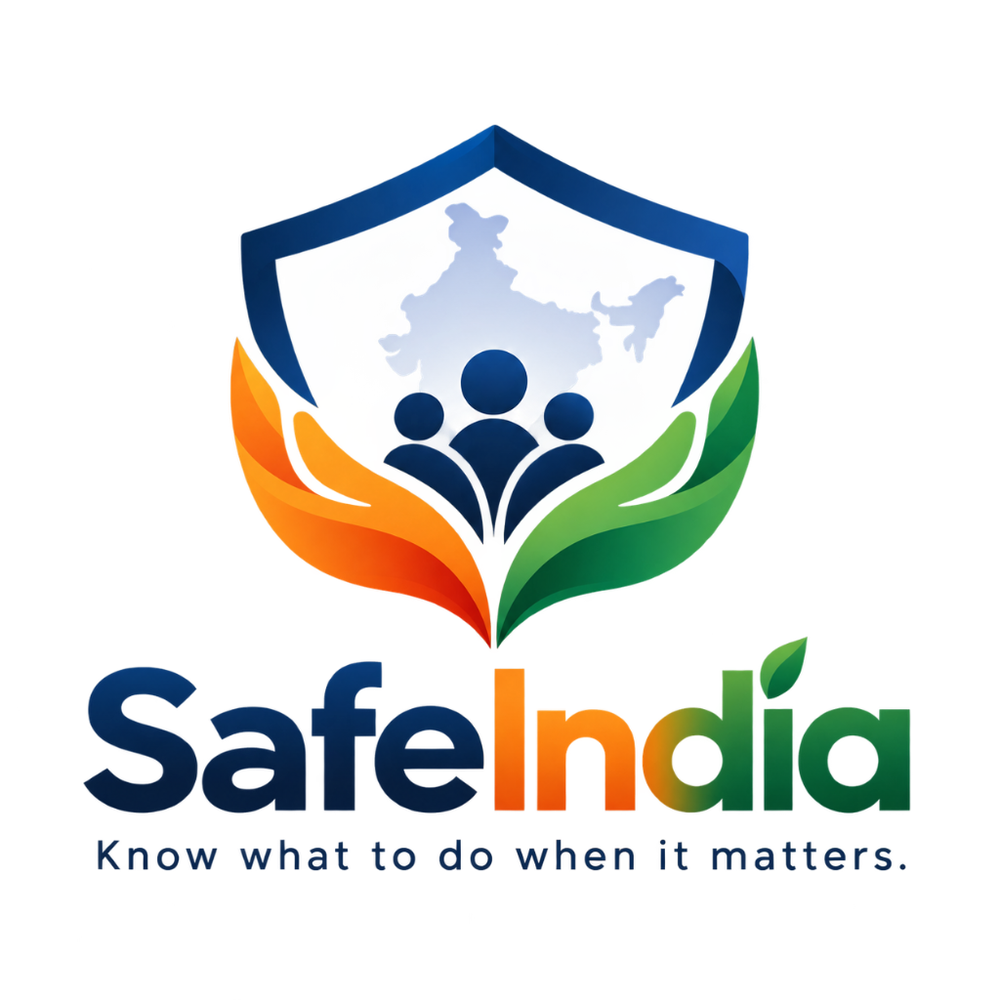
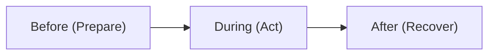

<div align="center">

  

  # SafeIndia
  ### *Know what to do when it matters.*

  **A modern, mobile-first public-safety awareness & emergency action platform for India.**

  [](https://react.dev/)
  [](https://www.typescriptlang.org/)
  [](https://vitejs.dev/)
  [](https://tailwindcss.com/)
  [](#-official-sources--verification)
  [](#-core-idea)

</div>

---

## 📌 Core Idea

SafeIndia is a completely public, non-commercial platform built to answer one critical question:

> **"Something has happened. What should I do now?"**

When faced with dangerous, stressful, or emergency situations, people need practical, scenario-based, step-by-step instructions—not long articles, legalese, or complex navigation. SafeIndia provides immediate, verified action steps for emergencies, safety awareness, and official government helplines across India.

### 🔒 No Friction • 100% Public Access
- ❌ No login or signup
- ❌ No user accounts or passwords
- ❌ No data collection or tracking
- ❌ No ads or microservices
- ✅ Instant access on any mobile or desktop browser

---

## 🚀 Key Features

### 🚨 Scenario-Based Emergency Protocols
Immediate, step-by-step guidance formatted for low-stress reading during crises:
- **Personal Safety**: Stalking / being followed, unsafe cab or auto situations, harassment.
- **Medical Emergencies**: Unconscious person (CPR), heavy bleeding, choking, seizures.
- **Fire & Disaster**: Building fire evacuation, kitchen LPG cylinder gas leakage.
- **Road & Transport**: Road traffic accidents, Supreme Court Good Samaritan Law guidelines.
- **Digital Emergency**: UPI / Bank OTP fraud, stolen phone (CEIR IMEI block), account hacks.
- **Animal-Related**: Venomous snake bite protocol (ASV hospitals), dog attack / Rabies washing guide.

### 🛡️ Safety Awareness & Prevention
Actionable prevention guides and preparation checklists:
- **Situational Awareness & Night Travel**: Public transport habits, live location sharing.
- **Digital Scam Protection**: How to avoid UPI PIN traps, fake job scams, and phishing links.
- **Home Electrical & Gas Safety**: Suraksha hose rules, fire extinguishers, MCB setup.
- **Disaster Survival (Earthquake & Flood)**: Emergency Go-Bag preparation, Drop-Cover-Hold rules.

### 📍 Verified Official Helplines Directory
Complete, structured directory of official Indian emergency contacts:
- **112**: National Emergency Response System (NERS - Police, Fire, Rescue)
- **1930**: National Cyber Crime Helpline (Fund Freeze / Financial Fraud)
- **108 / 102**: National Ambulance Medical Service
- **1091 / 181**: Women Helpline (24/7 Distress Support)
- **1098**: Childline India
- **101**: Fire Emergency Services
- **14416**: Tele-MANAS Mental Health Helpline (20+ Indian Languages)
- **1078 / 1070**: NDMA Disaster Management Helpline
- **139**: Indian Railways Rail Madad Helpline
- **1906**: LPG Cooking Gas Leak Emergency

Each directory card displays: *Service Name*, *What it is for*, *Who can use it*, *1-Tap Phone Dialing*, *Copy Number*, *Official Portal Link*, *Availability*, and *Verified Source Authority*.

### 🔍 Global Instant Search (`Ctrl+K` / `⌘K`)
- Search across all scenarios, guides, and helplines.
- Prioritizes **Emergency Scenarios** over general awareness content for instant crisis response.

### 🤖 Smart Protocol Matcher
- Natural language query matcher (e.g., *"Someone is following me near metro"* or *"Money deducted via UPI OTP"*).
- Matches queries directly to pre-approved, verified SafeIndia protocols without generating unverified AI hallucinations.

### 🌐 Bilingual Support (English & हिन्दी)
- One-click language switcher (`EN` / `हिन्दी`) for UI labels, emergency steps, and directory items.

### 📱 Mobile-First Design & Quick Access
- Persistent floating `🚨 Emergency Help` button on mobile devices.
- High-contrast typography, readable font sizes, and accessible focus states.

---

## 🎨 Design Philosophy & Palette

SafeIndia is built on a 3-step action philosophy:



### Color System & Brand Identity
Derived from the official SafeIndia branding and Indian visual identity:
- **Deep Ashoka Chakra Navy (`#0B2545` / `#0D2344`)**: Primary structural brand color for navbar, headings, filters, and borders.
- **White / Off-White (`#F8FAFC` / `#FFFFFF`)**: Main surface color for crisp contrast and low-stress reading.
- **Saffron (`#E85D04`) & Green (`#15803D`)**: Subtle, restrained accents for tags, highlights, and verified badges.
- **Emergency Red (`#DC2626`)**: Reserved **exclusively** for immediate danger banners and life-threatening actions.

---

## 🛠️ Tech Stack

- **Frontend Framework**: [React 18](https://react.dev/) + [TypeScript](https://www.typescriptlang.org/)
- **Build Tool**: [Vite](https://vitejs.dev/)
- **Styling**: [Tailwind CSS v3](https://tailwindcss.com/)
- **Icons**: [Lucide React](https://lucide.dev/)
- **Typography**: Plus Jakarta Sans & Inter (Google Fonts)

---

## ⚡ Quick Start & Local Installation

### Prerequisites
- Node.js `v18.x` or higher
- npm `v9.x` or higher

### Installation Steps

1. **Clone the repository:**
   ```bash
   git clone https://github.com/ItsShivam05/Safe-India.git
   cd Safe-India
   ```

2. **Install dependencies:**
   ```bash
   npm install
   ```

3. **Start the local development server:**
   ```bash
   npm run dev
   ```
   Open your browser and navigate to `http://localhost:5173/`.

4. **Build for production:**
   ```bash
   npm run build
   ```

---

## 📁 Project Architecture

```text
SafeIndia/
├── public/
│   ├── safeindia-logo.png      # Official SafeIndia Brand Logo
│   └── favicon.svg
├── src/
│   ├── components/
│   │   ├── Navbar.tsx           # Sticky Header & Navigation
│   │   ├── Hero.tsx             # Main Hero Banner & Core Action Cards
│   │   ├── Philosophy.tsx       # Before / During / After Philosophy
│   │   ├── EmergenciesView.tsx  # Emergency Scenarios Grid
│   │   ├── ScenarioDetailView.tsx # Step-by-Step Scenario Protocol
│   │   ├── AwarenessView.tsx    # Prevention Guides & Checklists
│   │   ├── ResourcesView.tsx    # Official Helpline Directory
│   │   ├── AIProtocolMatcher.tsx # Smart Query Scenario Matcher
│   │   ├── AboutView.tsx        # Mission & Core Principles
│   │   ├── SearchModal.tsx      # Global Instant Search (Ctrl+K)
│   │   ├── MobileQuickAccess.tsx# Mobile Floating Emergency Access
│   │   └── Footer.tsx           # Footer & Disclaimer Notice
│   ├── data/
│   │   ├── emergencies.ts       # Emergency Scenarios Data
│   │   ├── awareness.ts         # Awareness Guides Data
│   │   ├── resources.ts         # Official Helplines Directory Data
│   │   └── locales.ts           # i18n English & Hindi Dictionaries
│   ├── types/
│   │   └── index.ts             # TypeScript Interfaces
│   ├── App.tsx                  # Main App Orchestrator
│   └── index.css                # Tailwind Directives & Custom CSS
├── index.html                   # HTML Entry point
├── tailwind.config.js           # Custom SafeIndia Theme Config
└── package.json
```

---

## 🏛️ Official Sources & Verification

All safety advice, step-by-step emergency actions, and helpline numbers on SafeIndia are cross-referenced with official authorities:

- **Ministry of Home Affairs (MHA)** — [112 NERS Portal](https://112.gov.in)
- **Indian Cyber Crime Coordination Centre (I4C)** — [Cyber Crime Portal](https://cybercrime.gov.in)
- **Ministry of Road Transport and Highways (MoRTH)** — Good Samaritan Guidelines
- **National Disaster Management Authority (NDMA)** — [NDMA India](https://ndma.gov.in)
- **Department of Telecommunications (DoT)** — [CEIR Sanchar Saathi](https://ceir.gov.in)
- **Indian Council of Medical Research (ICMR)** — Snakebite Protocol
- **National Rabies Control Programme (NRCP)** — NCDC Rabies Guidelines
- **Indian Red Cross Society & AIIMS Emergency Medicine**

---

## ⚠️ Important Disclaimer

> **SafeIndia provides educational information and does not replace emergency services, medical professionals, law enforcement, or official authorities. In an immediate life-threatening emergency, contact official emergency services directly (112 / 100 / 108 / 1930).**

---

## 📄 License

This project is open-source and released under the [MIT License](LICENSE). Built for public safety awareness in India.
